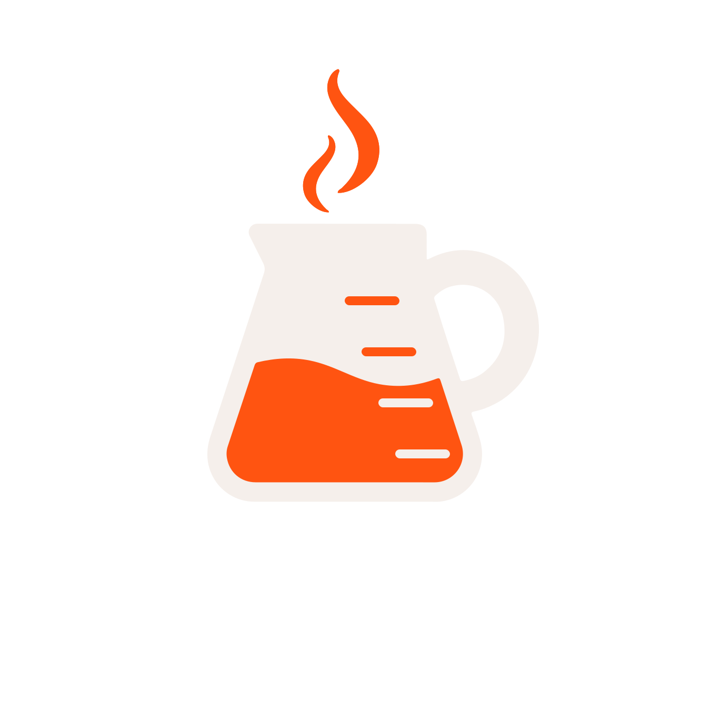

  <!-- O GitHub vai renderizar a logo aqui. Adaptável para Dark/Light mode via HTML picture (opcional) ou img simples -->
  

  # Café Labs
  **Laboratório de Infraestrutura e Desenvolvimento**

  Filtrando o ruído, extraindo a tecnologia pura e acelerando a validação do seu Produto.

  
  
  
  

---

## ☕ Sobre o Projeto

O **Café Labs** é um estúdio/laboratório focado na construção de produtos digitais, MVPs e arquitetura de software escalável. Nosso ecossistema é desenhado para empresas e fundadores que buscam inovação técnica aliada a um design funcional.

Este repositório contém o código-fonte da landing page institucional e portal do laboratório, construído com foco absoluto em performance, SEO e acessibilidade.

---

## 🎨 Identidade Visual (Design System)

A interface foi projetada para transmitir seriedade de engenharia aliada à energia criativa. O suporte nativo ao modo Claro e Escuro garante acessibilidade e conforto visual em qualquer ambiente.

*   **Cor Primária (Energia/Foco):** Laranja Elétrico (`#FF5411`). Utilizado em botões de ação (CTAs), links ativos e no "combustível" do logotipo.
*   **Base UI:** Adaptação fluida através de propriedades `currentColor`, com fundos em escala de cinza profundo no *Dark Mode* e contrastes nítidos no *Light Mode*.
*   **Logotipo:** A *Jarra-Erlenmeyer*. A fusão do ecossistema de testes de laboratório (o frasco) com o combustível da execução (o café e a chama).
*   **Tipografia (Headings & Logo):** Poppins (Trazendo peso, geometria e modernidade).
*   **Tipografia (UI & Body):** Inter (Garantindo máxima legibilidade em textos longos e navegação).

---

## 🚀 Arquitetura & Tech Stack

Este projeto utiliza o que há de mais moderno no ecossistema React:

*   **Framework:** Next.js (App Router)
*   **Estilização:** Tailwind CSS (Utilitário-primeiro, otimizado para produção)
*   **Animações:** Framer Motion (Transições fluidas de estado e navegação)
*   **Ícones:** Lucide React & SVGs Customizados
*   **Deploy:** Vercel (Edge Network)

---
